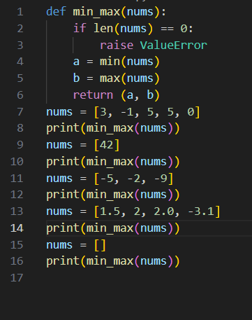

## Лабораторная работа 1
            
Задание 1
1. name = input("Имя: ")

2. age = int(input("Возраст: "))

3. print(f"Привет, {name}! Через год тебе будет {age + 1}.")

Задание 2
1. a = float(input(("Введите первое число=")))

2. b = float(input(("Введите первое число=")))

3. sum=a+b

4. avg = sum/2

5. print(f"sum={sum:.2f}",";",f"avg={avg:.2f}")

            
Задание 3
1. price = float(input("Введите цену="))

2. discount= float(input("Скидка="))

3. vat = float(input("НДС="))

4. base = price*(1-discount/100)

5. vat_amount = base * vat / 100

6. total = base + vat_amount

7. print(f"База после скидки:{base:.2f} ₽")

8. print(f"НДС:{vat_amount:.2f} ₽")

9. print(f"Итого к оплате:{total:.2f} ₽")

Задание 4
1. m = int(input("Введите количество минут="))

2. h = m//60

3. mm = m % 60

4. print(f"{h}:{mm:02d}")

Задание 5
1. fio = input("Введите ФИО ").split()

2. print("Инициалы=",fio[0][0],fio[1][0],fio[2][0],sep='')

3. print(len(fio[0]+fio[1]+fio[2])+2)

## Лабараторная работа 2
Задание 1
1. def min_max(nums):

2.   if len(nums) == 0:

3.        raise ValueError

4.    a = min(nums)

5.    b = max(nums)

6.    return (a, b)
