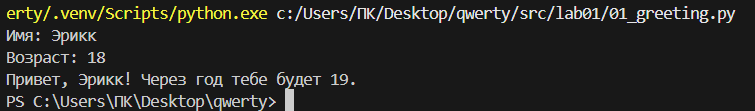
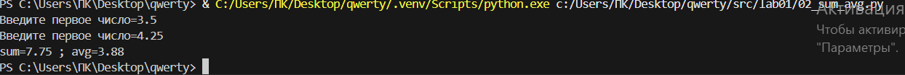
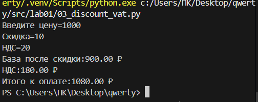
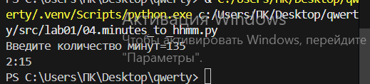
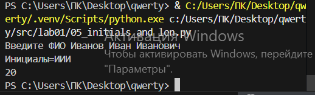

## Лабораторная работа 1
            
Задание 1
```python
1. name = input("Имя: ")

2. age = int(input("Возраст: "))

3. print(f"Привет, {name}! Через год тебе будет {age + 1}.")
```


Задание 2
```python
1. a = float(input(("Введите первое число=")))

2. b = float(input(("Введите первое число=")))

3. sum=a+b

4. avg = sum/2

5. print(f"sum={sum:.2f}",";",f"avg={avg:.2f}")
```

            
Задание 3
```python
1. price = float(input("Введите цену="))

2. discount= float(input("Скидка="))

3. vat = float(input("НДС="))

4. base = price*(1-discount/100)

5. vat_amount = base * vat / 100

6. total = base + vat_amount

7. print(f"База после скидки:{base:.2f} ₽")

8. print(f"НДС:{vat_amount:.2f} ₽")

9. print(f"Итого к оплате:{total:.2f} ₽")
```


Задание 4
```python
1. m = int(input("Введите количество минут="))

2. h = m//60

3. mm = m % 60

4. print(f"{h}:{mm:02d}")
```


Задание 5
```python
1. fio = input("Введите ФИО ").split()

2. print("Инициалы=",fio[0][0],fio[1][0],fio[2][0],sep='')

3. print(len(fio[0]+fio[1]+fio[2])+2)
```


## Лабараторная работа 2
Задание 1
```python
1. def min_max(nums):

2.   if len(nums) == 0:

3.        raise ValueError

4.    a = min(nums)

5.    b = max(nums)

6.    return (a, b)
```


Задание 2
```python
1. def unique_sorted(nums):

2.   nums = sorted(set(nums))

3.   return nums
```


Задание 3
```python
1. def flatten(mat):

2.    otvet = []

3.    for element in mat:

4.        if type(element)==tuple or type(element)==list:

5.            for podelement in element:

6.                otvet.append(podelement)

7.        else:

8.            raise TypeError

9.    return otvet
```

Задание 4
```python
1.def transpose(mat):

2.    otvet = []

3.    if len(mat) == 0:

4.        return []

5.    kol_simv = len(mat[0])

6.    for element in mat:

7.        if len(element)!=kol_simv:

8.            raise ValueError

9.    for stolb in range(kol_simv):

10.      new_stroch = []

11.        for strochka in range(len(mat)):

12.            new_stroch.append(mat[strochka][stolb])

13.        otvet.append(new_stroch)

14.    return otvet
```

Задание 5
```python
1.def row_sums(mat):

2.    kol_simv = len(mat[0])

3.    for element in mat:

4.        if len(element)!=kol_simv:

5.            raise ValueError

6.    spisok = []

7.    for element in mat:

8.        summa=0

9.        summa = sum(element)

10.        spisok.append(summa)

11.    return spisok
```

Задание 6
```python
1.def col_sums(mat):

2.    kol_simv = len(mat[0])

3.    for element in mat:

4.        if len(element)!=kol_simv:

5.            raise ValueError

6.    spisok=[0] * kol_simv

7.    for stroch in mat:

8.        for stolb in range(len(stroch)):

9.            spisok[stolb]=spisok[stolb]+stroch[stolb]

10.    return spisok
```
Задание 7
```python
1.def format_record(poveselee):

2.    sper = ''

3.    if type(poveselee) != tuple:

4.        raise TypeError

5.    if type(poveselee[0])==str and type(poveselee[1])==str and type(poveselee[2])==float and len(poveselee[0].split()) >= 2:

6.        if len(poveselee[0].split()) == 2:

7.            fio = poveselee[0].split()

8.            fio_new = f'{fio[0].capitalize()} {fio[1][0].capitalize()}.'

9.        if len(poveselee[0].split()) == 3:

10.            fio = poveselee[0].split()

11.            fio_new = f'{fio[0].capitalize()} {fio[1][0].capitalize()}.{fio[2][0].capitalize()}.'

12.        sper = f'{fio_new}, гр. {poveselee[1]}, GPA {poveselee[2]:.2f}'

13.    else:

14.        raise TypeError

15.    return sper
```