## Лабораторная работа 1
            
Задание 1
```python
1. name = input("Имя: ")

2. age = int(input("Возраст: "))

3. print(f"Привет, {name}! Через год тебе будет {age + 1}.")
```


Задание 2
```python
1. a = float(input(("Введите первое число=")))

2. b = float(input(("Введите первое число=")))

3. sum=a+b

4. avg = sum/2

5. print(f"sum={sum:.2f}",";",f"avg={avg:.2f}")
```
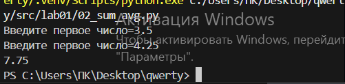
            
Задание 3
```python
1. price = float(input("Введите цену="))

2. discount= float(input("Скидка="))

3. vat = float(input("НДС="))

4. base = price*(1-discount/100)

5. vat_amount = base * vat / 100

6. total = base + vat_amount

7. print(f"База после скидки:{base:.2f} ₽")

8. print(f"НДС:{vat_amount:.2f} ₽")

9. print(f"Итого к оплате:{total:.2f} ₽")
```
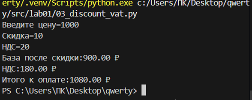

Задание 4
```python
1. m = int(input("Введите количество минут="))

2. h = m//60

3. mm = m % 60

4. print(f"{h}:{mm:02d}")
```


Задание 5
```python
1. fio = input("Введите ФИО ").split()

2. print("Инициалы=",fio[0][0],fio[1][0],fio[2][0],sep='')

3. print(len(fio[0]+fio[1]+fio[2])+2)
```
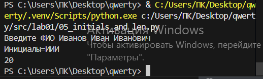

## Лабараторная работа 2
Задание 1
```python
1. def min_max(nums):

2.   if len(nums) == 0:

3.        raise ValueError

4.    a = min(nums)

5.    b = max(nums)

6.    return (a, b)
```
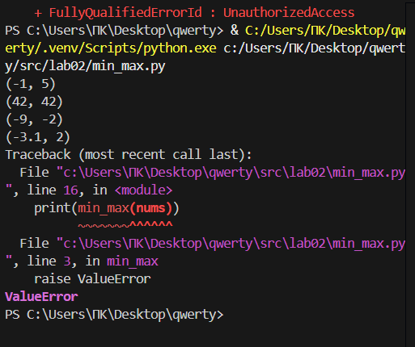

Задание 2
```python
1. def unique_sorted(nums):

2.   nums = sorted(set(nums))

3.   return nums
```
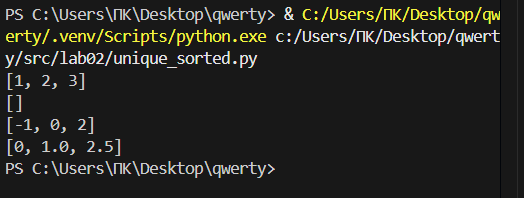

Задание 3
```python
1. def flatten(mat):

2.    otvet = []

3.    for element in mat:

4.        if type(element)==tuple or type(element)==list:

5.            for podelement in element:

6.                otvet.append(podelement)

7.        else:

8.            raise TypeError

9.    return otvet
```
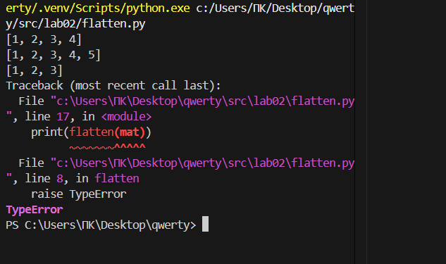

Задание 4
```python
1.def transpose(mat):

2.    otvet = []

3.    if len(mat) == 0:

4.        return []

5.    kol_simv = len(mat[0])

6.    for element in mat:

7.        if len(element)!=kol_simv:

8.            raise ValueError

9.    for stolb in range(kol_simv):

10.      new_stroch = []

11.        for strochka in range(len(mat)):

12.            new_stroch.append(mat[strochka][stolb])

13.        otvet.append(new_stroch)

14.    return otvet
```
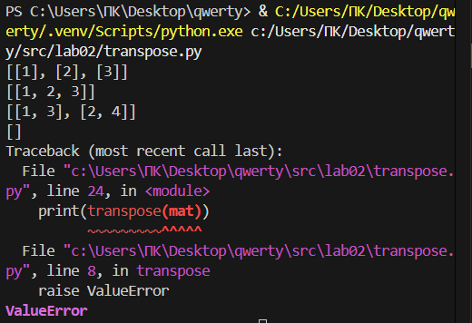

Задание 5
```python
1.def row_sums(mat):

2.    kol_simv = len(mat[0])

3.    for element in mat:

4.        if len(element)!=kol_simv:

5.            raise ValueError

6.    spisok = []

7.    for element in mat:

8.        summa=0

9.        summa = sum(element)

10.        spisok.append(summa)

11.    return spisok
```
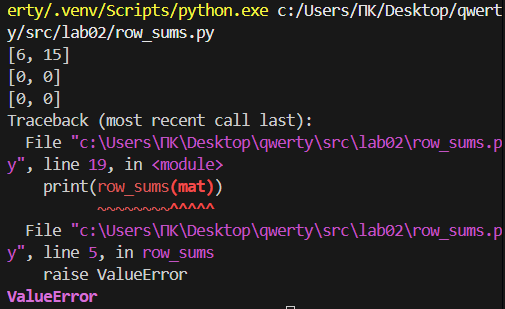

Задание 6
```python
1.def col_sums(mat):

2.    kol_simv = len(mat[0])

3.    for element in mat:

4.        if len(element)!=kol_simv:

5.            raise ValueError

6.    spisok=[0] * kol_simv

7.    for stroch in mat:

8.        for stolb in range(len(stroch)):

9.            spisok[stolb]=spisok[stolb]+stroch[stolb]

10.    return spisok
```
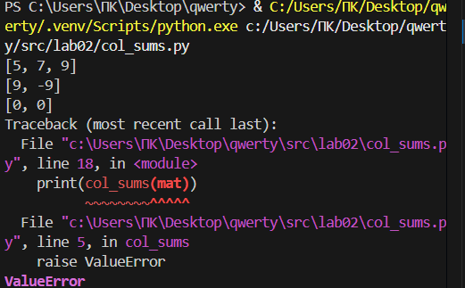

Задание 7
```python
1.def format_record(poveselee):

2.    sper = ''

3.    if type(poveselee) != tuple:

4.        raise TypeError

5.    if type(poveselee[0])==str and type(poveselee[1])==str and type(poveselee[2])==float and len(poveselee[0].split()) >= 2:

6.        if len(poveselee[0].split()) == 2:

7.            fio = poveselee[0].split()

8.            fio_new = f'{fio[0].capitalize()} {fio[1][0].capitalize()}.'

9.        if len(poveselee[0].split()) == 3:

10.            fio = poveselee[0].split()

11.            fio_new = f'{fio[0].capitalize()} {fio[1][0].capitalize()}.{fio[2][0].capitalize()}.'

12.        sper = f'{fio_new}, гр. {poveselee[1]}, GPA {poveselee[2]:.2f}'

13.    else:

14.        raise TypeError

15.    return sper
```
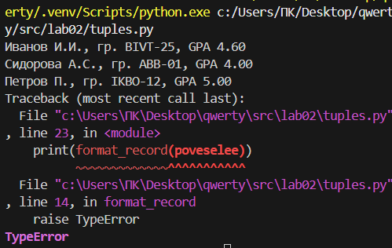

## Лабараторная работа 3
Задание 1
```python
import re
def normalize(text, *, casefold = True, yo2e = True):
    text = re.sub(r"[\t\r\n\f\v]", " ", text)
    if yo2e:
        text = text.replace("ё", "е").replace("Ё", "Е")
    if casefold:
        text = text.casefold()
    text = re.sub(r" +", " ", text)
    text = text.strip()
    return text

def tokenize(text):
    pattern = r"\b[\w]+(?:-[\w]+)*\b"
    return re.findall(pattern, text)

def count_freq(tokens):
    freq = {}
    for token in tokens:
        if token in freq:
            freq[token] = freq[token] + 1
        else:
            freq[token] = 1
    return freq
def top_n(freq, n = 2):
    spisok = []
    for word in freq:
        spisok.append((freq[word], word))
    spisok.sort(reverse=True)
    sortelement = []
    for count, word in spisok:
        sortelement.append((word, count))   
    return sortelement[:n]
 ```


Задание 2
```python
import sys
import re
def normalize(text, *, casefold = True, yo2e = True):
    text = re.sub(r"[\t\r\n\f\v]", " ", text)
    if yo2e:
        text = text.replace("ё", "е").replace("Ё", "Е")
    if casefold:
        text = text.casefold()
    text = re.sub(r" +", " ", text)
    text = text.strip()
    return text

def tokenize(text):
    pattern = r"\b[\w]+(?:-[\w]+)*\b"
    return re.findall(pattern, text)

def count_freq(tokens):
    freq = {}
    for token in tokens:
        if token in freq:
            freq[token] = freq[token] + 1
        else:
            freq[token] = 1
    return freq
def top_n(freq, n = 2):
    spisok = []
    for word in freq:
        spisok.append((freq[word], word))
    spisok.sort(reverse=True)
    sortelement = []
    for count, word in spisok:
        sortelement.append((word, count))   
    return sortelement[:n]

def stdin1():
    text = sys.stdin.read()

    normalized_text = normalize(text)
    tokens = tokenize(normalized_text)
    freq = count_freq(tokens)
    top_words = top_n(freq, 5)
    print("Всего слов:", len(tokens))
    print("Уникальных слов:", len(freq))
    print("Топ 5:")
    kolvo = {}
    for word in freq:
        if word in kolvo:
            kolvo[word] += 1
        else:
            kolvo[word] = 1
    for word, count in top_words:
        print(word,":", count,sep="")

if __name__ == "__main__":
    stdin1()
```


## Лабараторная работа 4
Задание 1
```python
from pathlib import Path
import csv

def chtenie(path, encoding="utf-8"):
    file_path = Path(path)
    with open(file_path, "r", encoding=encoding) as file:
        stroka = file.read()
        return stroka

def zapis(rows, path, header=None):
    file_path = Path(path)
    create_folders(file_path)
    if rows:
        first_row_length = len(rows[0])
        for row in rows:
            if len(row) != first_row_length:
                raise ValueError(f"Все строки должны быть одинаковой длины!")
    
    with open(file_path, "w", newline="", encoding="utf-8") as file:
        writer = csv.writer(file)
        
        if header is not None:
            writer.writerow(header)
        
        for row in rows:
            writer.writerow(row)


def create_folders(path):
    file_path = Path(path)
    folder_path = file_path.parent
    folder_path.mkdir(parents=True, exist_ok=True)

try:
    text = chtenie("data/input.txt")
    print(f"Содержимое: {text}")
    zapis([("test", 3)], "data/check.csv", header=("word", "count"))
except FileNotFoundError:
    print("Ошибка: файл не найден")
except UnicodeDecodeError:
    print("Ошибка: неправильная кодировка файла")
```

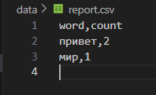
Задание 2
```python
import csv
import re
import os
def chtenie(path, encoding="utf-8"):
    with open(path, "r", encoding=encoding) as file:
        return file.read()

def zapisat(rows, path, header=None):
    with open(path, "w", newline="", encoding="utf-8-sig") as file:
        writer = csv.writer(file)
        if header is not None:
            writer.writerow(header)
        for row in rows:
            writer.writerow(row)
def normalize(text, *, casefold = True, yo2e = True):
    text = re.sub(r"[\t\r\n\f\v]", " ", text)
    if yo2e:
        text = text.replace("ё", "е").replace("Ё", "Е")
    if casefold:
        text = text.casefold()
    text = re.sub(r" +", " ", text)
    text = text.strip()
    return text
def tokenize(text):
    pattern = r"\b[\w]+(?:-[\w]+)*\b"
    return re.findall(pattern, text)
def count_freq(tokens):
    freq = {}
    for token in tokens:
        if token in freq:
            freq[token] = freq[token] + 1
        else:
            freq[token] = 1
    return freq
def top_n(freq, n = 2):
    spisok = []
    for word in freq:
        spisok.append((freq[word], word))
    spisok.sort(reverse=True)
    sortelement = []
    for count, word in spisok:
        sortelement.append((word, count))   
    return sortelement[:n]
try:
    text = chtenie("data/input.txt")
    clean_text = normalize(text)
    words = tokenize(clean_text)
    freq_dict = count_freq(words)
    top_words = top_n(freq_dict, 5)  # топ-5 слов
    
    sorted_items = sorted(freq_dict.items(), key=lambda x: (-x[1], x[0]))

    rows = []
    for word, count in sorted_items:
        rows.append((word, str(count)))

    zapisat(rows, "data/report.csv", header=("word", "count"))

    print(f"Всего слов: {len(words)}")
    print(f"Уникальных слов: {len(freq_dict)}")
    print("Топ-5:")
    for word, count in top_words:
        print(f"{word}:{count}")
    
except FileNotFoundError:
    print("Ошибка: файл не найден")
except UnicodeDecodeError:
    print("Ошибка: неправильная кодировка файла")
```
