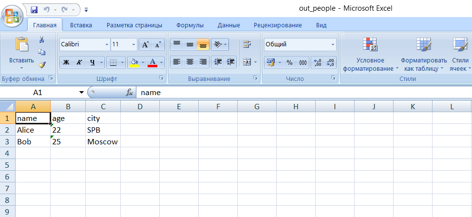

## Лабараторная работа 5
Задание 1
```python
import csv
import json
from pathlib import Path


def json_to_csv(json_path: str, csv_path: str) -> None:
    json_file = Path(json_path)
    csv_file = Path(csv_path)

    if not json_file.exists():
        raise FileNotFoundError(f"JSON-файл не найден: {json_file}")

    with json_file.open("r", encoding="utf-8") as file:
        data = json.load(file)

    if not isinstance(data, list) or not all(isinstance(item, dict) for item in data):
        raise ValueError("Ожидался список словарей")

    fieldnames = list(data[0].keys())

    with csv_file.open("w", encoding="utf-8", newline="") as file:
        writer = csv.DictWriter(file, fieldnames, extrasaction="ignore")
        writer.writeheader()
        for row in data:
            writer.writerow({k: row.get(k, "") for k in fieldnames})


def csv_to_json(csv_path: str, json_path: str) -> None:
    csv_file = Path(csv_path)
    json_file = Path(json_path)

    if not csv_file.exists():
        raise FileNotFoundError(f"CSV-файл не найден: {csv_file}")

    with csv_file.open("r", encoding="utf-8", newline="") as file:
        reader = csv.DictReader(file)
        if not reader.fieldnames:
            raise ValueError("CSV не содержит заголовка")

        data = [dict(row) for row in reader]

    with json_file.open("w", encoding="utf-8") as f:
        json.dump(data, f)


if __name__ == "__main__":
    json_path = "lab05/data/samples/people.json"
    csv_out_path = "lab05/data/out/out_people.csv"
    json_to_csv(json_path, csv_out_path)

    csv_path = "lab05/data/samples/people.csv"
    json_out_path = "lab05/data/out/out_people.json"
    csv_to_json(csv_path, json_out_path)
```


Задание 2
```python
import csv
from pathlib import Path
from openpyxl import Workbook
from openpyxl.utils import get_column_letter


def csv_to_xlsx(csv_path: str, xlsx_path: str) -> None:
    csv_file = Path(csv_path)
    xlsx_file = Path(xlsx_path)

    if not csv_file.exists():
        raise FileNotFoundError(f"CSV-файл не найден: {csv_file}")

    wb = Workbook()
    ws = wb.active
    ws.title = "Sheet1"

    col_widths = {}

    with csv_file.open("r", encoding="utf-8", newline="") as f:
        reader = csv.reader(f)
        for row in reader:
            ws.append(row)
            for col_index, cell_value in enumerate(row, start=1):
                length = len(str(cell_value))
                if length > col_widths.get(col_index, 0):
                    col_widths[col_index] = length

    for col_index, width in col_widths.items():
        col_letter = get_column_letter(col_index)
        ws.column_dimensions[col_letter].width = max(width + 2, 8)

    wb.save(xlsx_file)


if __name__ == "__main__":
    csv_path = "lab05/data/samples/people.csv"
    xlsx_path = "lab05/data/out/out_people.xlsx"

    csv_to_xlsx(csv_path, xlsx_path)
    ```

