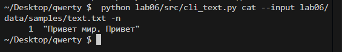
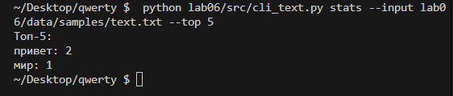
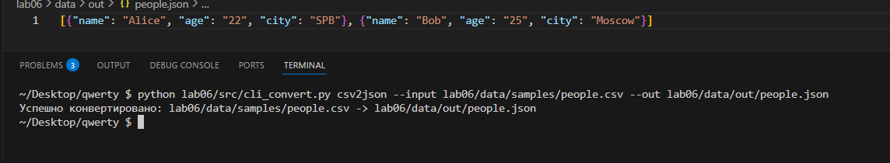
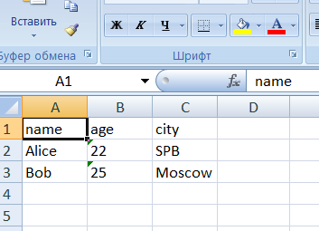

## Лабараторная работа 6
Задание 1
```python
import argparse
import sys
import re


def normalize(text, *, casefold=True, yo2e=True):
    text = re.sub(r"[\t\r\n\f\v]", " ", text)
    if yo2e:
        text = text.replace("ё", "е").replace("Ё", "Е")
    if casefold:
        text = text.casefold()
    text = re.sub(r" +", " ", text)
    text = text.strip()
    return text


def tokenize(text):
    pattern = r"\b[\w]+(?:-[\w]+)*\b"
    return re.findall(pattern, text)


def count_freq(tokens):
    freq = {}
    for token in tokens:
        if token in freq:
            freq[token] = freq[token] + 1
        else:
            freq[token] = 1
    return freq


def top_n(freq, n=2):
    spisok = []
    for word in freq:
        spisok.append((freq[word], word))
    spisok.sort(reverse=True)
    sortelement = []
    for count, word in spisok:
        sortelement.append((word, count))
    return sortelement[:n]


def read_text_file(file_path):
    try:
        with open(file_path, "r", encoding="utf-8") as f:
            return f.read()
    except FileNotFoundError:
        print(f"Ошибка: Файл {file_path} не найден")
        sys.exit(1)
    except Exception as e:
        print(f"Ошибка при чтении файла: {e}")
        sys.exit(1)


def stats_command(args):
    text = read_text_file(args.input)
    normalized_text = normalize(text)
    tokens = tokenize(normalized_text)
    frequencies = count_freq(tokens)
    top_5 = top_n(frequencies, args.top)

    print("Топ-5:")

    for item in top_5:
        print(f"{item[0]}: {item[1]}")


def cat_command(args):
    """Обработка команды cat"""
    try:
        with open(args.input, "r", encoding="utf-8") as f:
            for line_num, line in enumerate(f, 1):
                if args.n:
                    print(f"{line_num:6}  {line}", end="")
                else:
                    print(line, end="")
    except FileNotFoundError:
        print(f"Ошибка: Файл {args.input} не найден")
        sys.exit(1)
    except Exception as e:
        print(f"Ошибка при чтении файла: {e}")
        sys.exit(1)


def main():
    parser = argparse.ArgumentParser(description="Утилиты для работы с текстом")
    subparsers = parser.add_subparsers(dest="command", help="Доступные команды")

    cat_parser = subparsers.add_parser("cat", help="Вывод содержимого файла")
    cat_parser.add_argument("--input", required=True, help="Путь к файлу")
    cat_parser.add_argument("-n", action="store_true", help="Нумеровать строки")

    stats_parser = subparsers.add_parser("stats", help="Анализ частот слов в тексте")
    stats_parser.add_argument("--input", required=True, help="Входной текстовый файл")
    stats_parser.add_argument(
        "--top", type=int, default=5, help="Количество топ слов (по умолчанию: 5)"
    )

    args = parser.parse_args()

    if args.command == "stats":
        stats_command(args)
    elif args.command == "cat":
        cat_command(args)
    else:
        parser.print_help()


if __name__ == "__main__":
    main()
```
Входной файл



Результат работы команды cat --input INPUT -n


Результат работы команды stats --input INPUT --top 5


Задание 2
```
import argparse
import sys
import csv
from pathlib import Path
from openpyxl import Workbook
from openpyxl.utils import get_column_letter
import json


def csv_to_xlsx(csv_path: str, xlsx_path: str) -> None:
    csv_file = Path(csv_path)
    xlsx_file = Path(xlsx_path)

    if not csv_file.exists():
        raise FileNotFoundError(f"CSV-файл не найден: {csv_file}")

    wb = Workbook()
    ws = wb.active
    ws.title = "Sheet1"

    col_widths = {}

    with csv_file.open("r", encoding="utf-8", newline="") as f:
        reader = csv.reader(f)
        for row in reader:
            ws.append(row)
            for col_index, cell_value in enumerate(row, start=1):
                length = len(str(cell_value))
                if length > col_widths.get(col_index, 0):
                    col_widths[col_index] = length

    for col_index, width in col_widths.items():
        col_letter = get_column_letter(col_index)
        ws.column_dimensions[col_letter].width = max(width + 2, 8)

    wb.save(xlsx_file)


def json_to_csv(json_path: str, csv_path: str) -> None:
    json_file = Path(json_path)
    csv_file = Path(csv_path)

    if not json_file.exists():
        raise FileNotFoundError(f"JSON-файл не найден: {json_file}")

    with json_file.open("r", encoding="utf-8") as file:
        data = json.load(file)

    if not isinstance(data, list) or not all(isinstance(item, dict) for item in data):
        raise ValueError("Ожидался список словарей")

    fieldnames = list(data[0].keys())

    with csv_file.open("w", encoding="utf-8", newline="") as file:
        writer = csv.DictWriter(file, fieldnames, extrasaction="ignore")
        writer.writeheader()
        for row in data:
            writer.writerow({k: row.get(k, "") for k in fieldnames})


def csv_to_json(csv_path: str, json_path: str) -> None:
    csv_file = Path(csv_path)
    json_file = Path(json_path)

    if not csv_file.exists():
        raise FileNotFoundError(f"CSV-файл не найден: {csv_file}")

    with csv_file.open("r", encoding="utf-8", newline="") as file:
        reader = csv.DictReader(file)
        if not reader.fieldnames:
            raise ValueError("CSV не содержит заголовка")

        data = [dict(row) for row in reader]

    with json_file.open("w", encoding="utf-8") as f:
        json.dump(data, f)


def json2csv_command(args):
    try:
        json_to_csv(args.infile, args.out)
        print(f"Успешно конвертировано: {args.infile} -> {args.out}")
    except Exception as e:
        print(f"Ошибка при конвертации JSON в CSV: {e}")
        sys.exit(1)


def csv2json_command(args):
    try:
        csv_to_json(args.infile, args.out)
        print(f"Успешно конвертировано: {args.infile} -> {args.out}")
    except Exception as e:
        print(f"Ошибка при конвертации CSV в JSON: {e}")
        sys.exit(1)


def csv2xlsx_command(args):
    try:
        csv_to_xlsx(args.infile, args.out)
        print(f"Успешно конвертировано: {args.infile} -> {args.out}")
    except Exception as e:
        print(f"Ошибка при конвертации CSV в XLSX: {e}")
        sys.exit(1)


def main():
    parser = argparse.ArgumentParser(description="Конвертер между форматами данных")

    subparsers = parser.add_subparsers(dest="command", help="Доступные команды")

    json2csv_parser = subparsers.add_parser("json2csv", help="Конвертация JSON в CSV")
    json2csv_parser.add_argument(
        "--input", dest="infile", required=True, help="Входной JSON файл"
    )
    json2csv_parser.add_argument("--out", required=True, help="Выходной CSV файл")

    csv2json_parser = subparsers.add_parser("csv2json", help="Конвертация CSV в JSON")
    csv2json_parser.add_argument(
        "--input", dest="infile", required=True, help="Входной CSV файл"
    )
    csv2json_parser.add_argument("--out", required=True, help="Выходной JSON файл")

    csv2xlsx_parser = subparsers.add_parser("csv2xlsx", help="Конвертация CSV в XLSX")
    csv2xlsx_parser.add_argument(
        "--input", dest="infile", required=True, help="Входной CSV файл"
    )
    csv2xlsx_parser.add_argument("--out", required=True, help="Выходной XLSX файл")

    args = parser.parse_args()

    if args.command == "json2csv":
        json2csv_command(args)
    elif args.command == "csv2json":
        csv2json_command(args)
    elif args.command == "csv2xlsx":
        csv2xlsx_command(args)
    else:
        parser.print_help()


if __name__ == "__main__":
    main()
```
Результат комнады json2csv


Результат команды csv2json



Результат команды csv2xlsx


