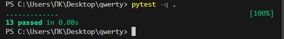
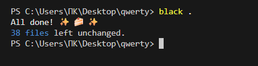

## Лабараторная работа 7
Задание 1
```python
import pytest
import sys
import re


def normalize(text, *, casefold=True, yo2e=True):
    text = re.sub(r"[\t\r\n\f\v]", " ", text)
    if yo2e:
        text = text.replace("ё", "е").replace("Ё", "Е")
    if casefold:
        text = text.casefold()
    text = re.sub(r" +", " ", text)
    text = text.strip()
    return text


def tokenize(text):
    pattern = r"\b[\w]+(?:-[\w]+)*\b"
    return re.findall(pattern, text)


def count_freq(tokens):
    freq = {}
    for token in tokens:
        if token in freq:
            freq[token] = freq[token] + 1
        else:
            freq[token] = 1
    return freq


def top_n(freq, n=2):
    spisok = []
    for word in freq:
        spisok.append((freq[word], word))
    spisok.sort(reverse=True)
    sortelement = []
    for count, word in spisok:
        sortelement.append((word, count))
    return sortelement[:n]


def read_text_file(file_path):
    try:
        with open(file_path, "r", encoding="utf-8") as f:
            return f.read()
    except FileNotFoundError:
        print(f"Ошибка: Файл {file_path} не найден")
        sys.exit(1)
    except Exception as e:
        print(f"Ошибка при чтении файла: {e}")
        sys.exit(1)


@pytest.mark.parametrize(
    "string, expected",
    [
        ("ПрИвЕт\nМИр\t", "привет мир"),
        ("ёжик, Ёлка", "ежик, елка"),
        ("Hello\r\nWorld", "hello world"),
        ("  двойные   пробелы  ", "двойные пробелы"),
    ],
)
def test_normalize(string, expected):
    assert normalize(string) == expected


@pytest.mark.parametrize(
    "string, expected",
    [
        ("привет мир", ["привет", "мир"]),
        ("hello,world!!!", ["hello", "world"]),
        ("по-настоящему круто", ["по-настоящему", "круто"]),
        ("2025 год", ["2025", "год"]),
        ("emoji 😀 не слово", ["emoji", "не", "слово"]),
    ],
)
def test_tokenize(string, expected):
    assert tokenize(string) == expected


@pytest.mark.parametrize(
    "massive, expected",
    [
        (["a", "b", "a", "c", "b", "a"], {"a": 3, "b": 2, "c": 1}),
        (["bb", "aa", "bb", "aa", "cc"], {"aa": 2, "bb": 2, "cc": 1}),
    ],
)
def test_count_freq(massive, expected):
    assert count_freq(massive) == expected


@pytest.mark.parametrize(
    "dictionary, expected",
    [
        ({"a": 3, "b": 2, "c": 1}, [("a", 3), ("b", 2)]),
        ({"aa": 2, "bb": 2, "cc": 1}, [("bb", 2), ("aa", 2)]),
    ],
)
def test_top_n(dictionary, expected):
    assert top_n(dictionary) == expected
```


Задание 2
```py
import csv
import json
import pytest
from pathlib import Path


def json_to_csv(json_path: str, csv_path: str) -> None:
    json_file = Path(json_path)
    csv_file = Path(csv_path)

    if not json_file.exists():
        raise FileNotFoundError(f"JSON-файл не найден: {json_file}")

    with json_file.open("r", encoding="utf-8") as file:
        data = json.load(file)

    if not isinstance(data, list) or not all(isinstance(item, dict) for item in data):
        raise ValueError("Ожидался список словарей")

    fieldnames = list(data[0].keys())

    with csv_file.open("w", encoding="utf-8", newline="") as file:
        writer = csv.DictWriter(file, fieldnames, extrasaction="ignore")
        writer.writeheader()
        for row in data:
            writer.writerow({k: row.get(k, "") for k in fieldnames})


def csv_to_json(csv_path: str, json_path: str) -> None:
    csv_file = Path(csv_path)
    json_file = Path(json_path)

    if not csv_file.exists():
        raise FileNotFoundError(f"CSV-файл не найден: {csv_file}")

    with csv_file.open("r", encoding="utf-8", newline="") as file:
        reader = csv.DictReader(file)
        if not reader.fieldnames:
            raise ValueError("CSV не содержит заголовка")

        data = [dict(row) for row in reader]

    with json_file.open("w", encoding="utf-8") as f:
        json.dump(data, f)


@pytest.fixture
def json_file(tmp_path):
    json_file = tmp_path / "people.json"
    data = [
        {"name": "Alice", "age": 25, "city": "Moscow"},
    ]
    with open(json_file, "w", encoding="utf-8") as f:
        json.dump(data, f, ensure_ascii=False)
    return json_file


def test_json_to_csv(json_file, tmp_path):
    csv_output = tmp_path / "output.csv"

    json_to_csv(str(json_file), str(csv_output))

    assert csv_output.exists()

    with open(csv_output, "r", encoding="utf-8") as f:
        reader = csv.DictReader(f)
        rows = list(reader)

        assert reader.fieldnames == ["name", "age", "city"]
        assert rows[0]["name"] == "Alice"
        assert rows[0]["age"] == "25"
        assert rows[0]["city"] == "Moscow"


@pytest.fixture
def csv_file(tmp_path):
    """Фикстура создает тестовый CSV файл"""
    csv_file = tmp_path / "people.csv"
    data = [
        {"name": "Alice", "age": "25", "city": "Moscow"},
    ]
    with open(csv_file, "w", encoding="utf-8", newline="") as f:
        writer = csv.DictWriter(f, fieldnames=["name", "age", "city"])
        writer.writeheader()
        writer.writerows(data)
    return csv_file


def test_csv_to_json(csv_file, tmp_path):
    """Тест конвертации CSV в JSON"""
    json_output = tmp_path / "output.json"

    csv_to_json(str(csv_file), str(json_output))

    assert json_output.exists()

    with open(json_output, "r", encoding="utf-8") as f:
        data = json.load(f)

        assert data[0]["name"] == "Alice"
        assert data[0]["age"] == "25"
        assert data[0]["city"] == "Moscow"
```



Black .


