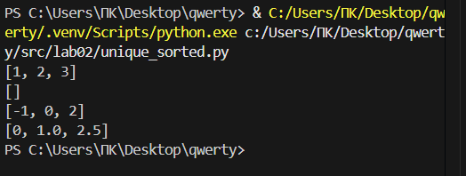
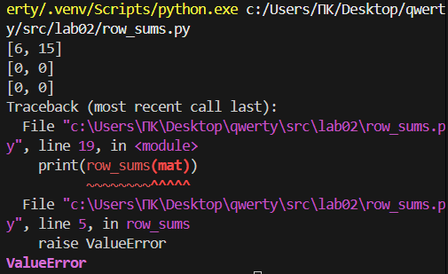
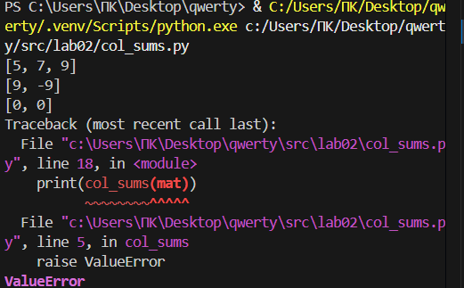

## Лабараторная работа 2
Задание 1
```python
def min_max(nums):
if len(nums) == 0:
  raise ValueError
a = min(nums)
b = max(nums)
  return (a, b)
```


Задание 2
```python
def unique_sorted(nums):
  nums = sorted(set(nums))
  return nums
```


Задание 3
```python
def flatten(mat):
  otvet = []
  for element in mat:
    if type(element)==tuple or type(element)==list:
      for podelement in element:
        otvet.append(podelement)
    else:
        raise TypeError

  return otvet
```


Задание 4
```python
def transpose(mat):
  otvet = []
  if len(mat) == 0:
    return []
  kol_simv = len(mat[0])
  for element in mat:
    if len(element)!=kol_simv:
        raise ValueError
  for stolb in range(kol_simv):
    new_stroch = []
    for strochka in range(len(mat)):
      new_stroch.append(mat[strochka][stolb])
      otvet.append(new_stroch)
  return otvet
```


Задание 5
```python
def row_sums(mat):
  kol_simv = len(mat[0])
  for element in mat:
    if len(element)!=kol_simv:
      raise ValueError
  spisok = []
  for element in mat:
    summa=0
    summa = sum(element)
    spisok.append(summa)
  return spisok
```


Задание 6
```python
def col_sums(mat):
  kol_simv = len(mat[0])
  for element in mat:
    if len(element)!=kol_simv:
      raise ValueError
  spisok=[0] * kol_simv
  for stroch in mat:
    for stolb in range(len(stroch)):
      spisok[stolb]=spisok[stolb]+stroch[stolb]
  return spisok
```


Задание 7
```python
def format_record(poveselee):
  sper = ''
  if type(poveselee) != tuple:
    raise TypeError
  if type(poveselee[0])==str and type(poveselee[1])==str and type(poveselee[2])==float and len(poveselee[0].split()) >= 2:
    if len(poveselee[0].split()) == 2:
      fio = poveselee[0].split()
      fio_new = f'{fio[0].capitalize()} {fio[1][0].capitalize()}.'
    if len(poveselee[0].split()) == 3:
      fio = poveselee[0].split()
      fio_new = f'{fio[0].capitalize()} {fio[1][0].capitalize()}.{fio[2][0].capitalize()}.'
      sper = f'{fio_new}, гр. {poveselee[1]}, GPA {poveselee[2]:.2f}'
  else:
    raise TypeError
  return sper
```

