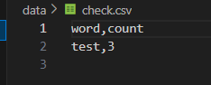
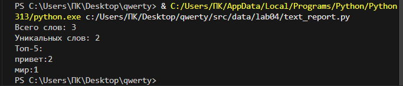

## Лабараторная работа 4
Задание 1
```python
from pathlib import Path
import csv

def chtenie(path, encoding="utf-8"):
    file_path = Path(path)
    with open(file_path, "r", encoding=encoding) as file:
        stroka = file.read()
        return stroka

def zapis(rows, path, header=None):
    file_path = Path(path)
    create_folders(file_path)
    if rows:
        first_row_length = len(rows[0])
        for row in rows:
            if len(row) != first_row_length:
                raise ValueError(f"Все строки должны быть одинаковой длины!")

    with open(file_path, "w", newline="", encoding="utf-8") as file:
        writer = csv.writer(file)

        if header is not None:
            writer.writerow(header)

        for row in rows:
            writer.writerow(row)


def create_folders(path):
    file_path = Path(path)
    folder_path = file_path.parent
    folder_path.mkdir(parents=True, exist_ok=True)

try:
    text = chtenie("data/input.txt")
    print(f"Содержимое: {text}")
    zapis([("test", 3)], "data/check.csv", header=("word", "count"))
except FileNotFoundError:
    print("Ошибка: файл не найден")
except UnicodeDecodeError:
    print("Ошибка: неправильная кодировка файла")
```



Задание 2
```python
import csv
import re
import os
def chtenie(path, encoding="utf-8"):
    with open(path, "r", encoding=encoding) as file:
        return file.read()

def zapisat(rows, path, header=None):
    with open(path, "w", newline="", encoding="utf-8-sig") as file:
        writer = csv.writer(file)
        if header is not None:
            writer.writerow(header)
        for row in rows:
            writer.writerow(row)
def normalize(text, *, casefold = True, yo2e = True):
    text = re.sub(r"[\t\r\n\f\v]", " ", text)
    if yo2e:
        text = text.replace("ё", "е").replace("Ё", "Е")
    if casefold:
        text = text.casefold()
    text = re.sub(r" +", " ", text)
    text = text.strip()
    return text
def tokenize(text):
    pattern = r"\b[\w]+(?:-[\w]+)*\b"
    return re.findall(pattern, text)
def count_freq(tokens):
    freq = {}
    for token in tokens:
        if token in freq:
            freq[token] = freq[token] + 1
        else:
            freq[token] = 1
    return freq
def top_n(freq, n = 2):
    spisok = []
    for word in freq:
        spisok.append((freq[word], word))
    spisok.sort(reverse=True)
    sortelement = []
    for count, word in spisok:
        sortelement.append((word, count))
    return sortelement[:n]
try:
    text = chtenie("data/input.txt")
    clean_text = normalize(text)
    words = tokenize(clean_text)
    freq_dict = count_freq(words)
    top_words = top_n(freq_dict, 5)  # топ-5 слов

    sorted_items = sorted(freq_dict.items(), key=lambda x: (-x[1], x[0]))

    rows = []
    for word, count in sorted_items:
        rows.append((word, str(count)))

    zapisat(rows, "data/report.csv", header=("word", "count"))

    print(f"Всего слов: {len(words)}")
    print(f"Уникальных слов: {len(freq_dict)}")
    print("Топ-5:")
    for word, count in top_words:
        print(f"{word}:{count}")

except FileNotFoundError:
    print("Ошибка: файл не найден")
except UnicodeDecodeError:
    print("Ошибка: неправильная кодировка файла")
```

